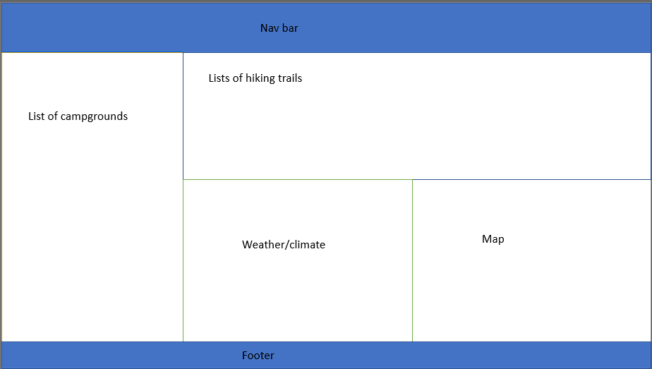
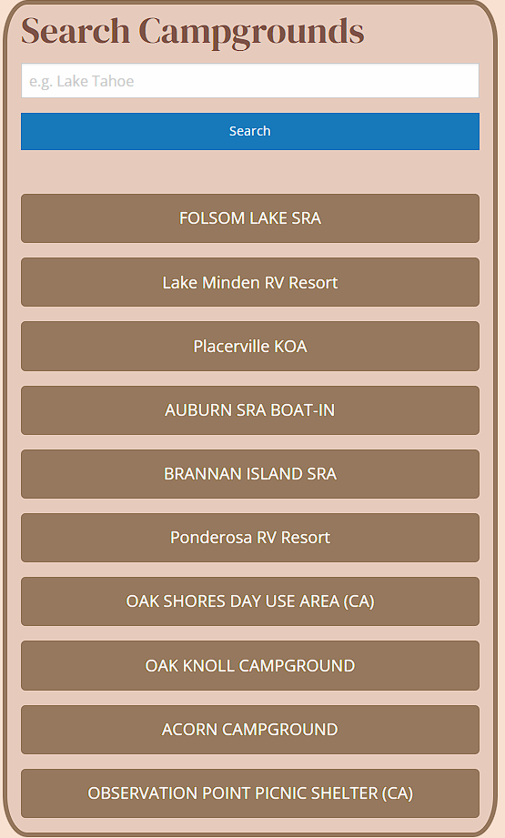
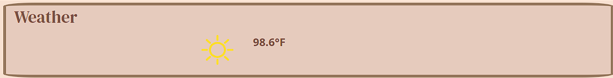

# Backcountry-buddy
The purpose of this project was to work collaborately with others applying our knowledge in using Git and our web development skills by using HTML, CSS, and JS to create a website. This web application allows user to search via origin point (City) and the application will return 10 results of campsites in a 200 mile vicinity of the origin point. And it will also display temperature of the input origin point and display campsites on the map when clicking on campsite results.

### Summary
* APIs were used in styling and grabbing all information needed to make the web application work
* HTML was used conservatively so that we may exercise our skills in JS and CSS
* CSS was used to style colors and fonts

### Features
* Get 10 campsites near origin point of search input
* Get temperature and weather conditions icon of the origin point
* Click on campsite and it will display on the map

### Wireframe

### Our process on our website development
AS A outdoors enthusiast
I WANT TO search a location
SO THAT I can find local campgrounds and weather data

### Screenshots
Page on load

Search results

Weather

Map